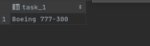
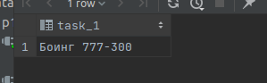
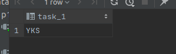
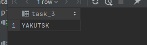
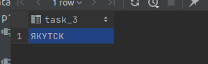

# Task 1

```sql
create or replace function task_1(model jsonb, lang varchar)
    returns text
    language plpgsql
as
$$
begin
    return model ->> lang;
end;
$$;
drop function task_4(model jsonb, lang varchar);

select aircraft_code, task_4(model, 'ru'), range
from aircrafts_data;

```

# en

,

# ru

,

# Task 2

```sql
create or replace function task_1(a text)
    returns text
    language plpgsql
as
$$
declare
    ttotal_amount varchar;
begin
    select airport_code, airport_name, airport_code, airport_name, city, coordinates, timezone
    into ttotal_amount
    from airports_data
    where timezone = a;
    return ttotal_amount;
end;
$$;


select task_1('Asia/Yakutsk');
```

<

# TASK 3 
```sql
create or replace function task_1(model jsonb, lang varchar)
    returns text
    language plpgsql
as
$$
begin
    return upper(model ->> lang);
end;
$$;
drop function task_4(model jsonb, lang varchar);

select aircraft_code, task_4(model, 'ru'), range
from aircrafts_data;

```
# en

,

# ru

,