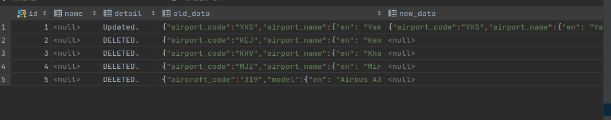

```sql
create or replace trigger aircrafts_data_update_trigger
    after update or delete
    on aircrafts_data
    for each row
execute procedure aircrafts_data_update_trigger_func();


create or replace function aircrafts_data_update_trigger_func()
    returns trigger
    language plpgsql
as
$$
BEGIN
    if tg_op = 'UPDATE' THEN
        insert into logs(detail, old_data, new_data, select_table)
        values ('Updated.', row_to_json(OLD), row_to_json(NEW), 'aircrafts_data');
        return NEW;
    elsif tg_op ='DELETE' THEN
        insert into logs(detail, old_data, select_table)
        values ('DELETED.', row_to_json(OLD), 'aircrafts_data');
        return OLD;
    END IF;
end;
$$;
```


```python
def unniversal_fun(table_name_update):
    # cur = connection.cursor()
    func_name = f"{table_name_update}_data_update_trigger_func()"
    func_trigger = f"""create or replace function {func_name}
            returns trigger
            language plpgsql
                    as
                    $$
                    BEGIN
                    if tg_op = 'UPDATE' THEN
                        insert into logs(detail, old_data, new_data, select_table)
                        values ('Updated.', row_to_json(OLD), row_to_json(NEW), {table_name_update});
                        return NEW;
                    elsif tg_op = 'DELETE' THEN
                        insert into logs(detail, old_data, select_table)
                        values ('DELETED.', row_to_json(OLD), {table_name_update});
                        return OLD;
                    END IF;
                    end;
                    $$;"""
    # cur.execute(func_trigger)
    # connection.commit()
    trigger = f"""
    create trigger {table_name_update}_data_update_trigger
    after update or delete
    on {table_name_update}
    for each row
execute procedure {func_name};
    """
    # cur.execute(trigger)
    # connection.commit()
unniversal_fun('table_name')

```

