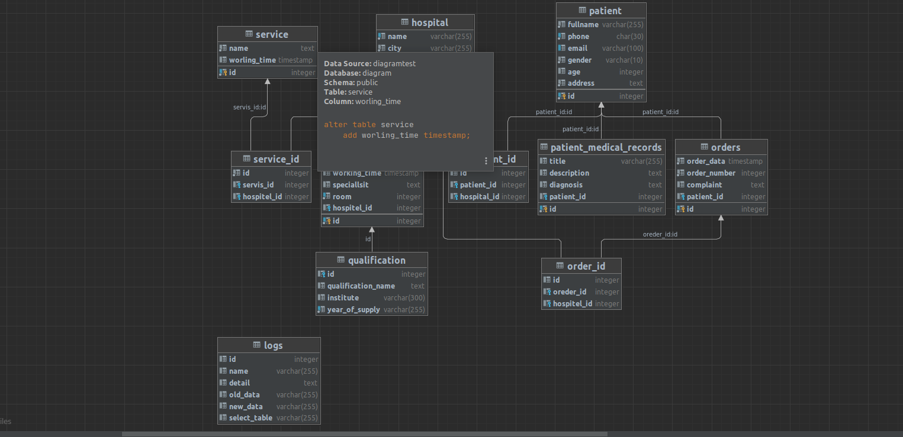

```sql
create table patient
(
    id       serial primary key,
    fullname varchar(255) not null,
    phone    char(30)     not null unique,
    email    varchar(100) unique,
    gender   varchar(10)  not null,
    age      int
);


create table if not exists patient_id
(
    id          int,
    patient_id  int references patient (id),
    hospital_id int references hospital (id)
);


create table hospital
(
    id          serial primary key,
    name        varchar(255) not null unique,
    city        varchar(255) not null,
    employees   varchar(255),
    workingtime timestamp

);

create table if not exists doctor
(
    id           serial primary key,
    firt_name    varchar(255) not null,
    last_name    varchar(255) not null,
    working_time timestamp,
    speciallsit  text,
    room         int          not null unique,
    hospitel_id  int references hospital (id)
);


create table if not exists order_id
(
    id          int,
    oreder_id   int references orders (id),
    hospitel_id int references hospital (id)
);

create table if not exists orders
(
    id           serial primary key,
    order_data   timestamp not null,
    order_number int       not null,
    complaint    text,
    patient_id   int references patient (id)
);

create table if not exists qualification
(
    id                 int references doctor (id),
    qualification_name text,
    institute          varchar(300),
    year_of_supply     varchar(255) not null unique
);
create table if not exists patient_medical_records
(
    id          serial primary key,
    title       varchar(255),
    description text,
    diagnosis   text,
    patient_id  int references patient (id)

);

create table service
(
    id           serial primary key,
    name         text not null,
    worling_time timestamp
);


create table service_id
(
    id          serial,
    servis_id   int references service (id),
    hospitel_id int references hospital (id)

);

create table logs
(
    id           integer,
    name         varchar(255),
    detail       text,
    old_data     varchar(255),
    new_data     varchar(255),
    select_table varchar(255)

);
```

# Diagram

